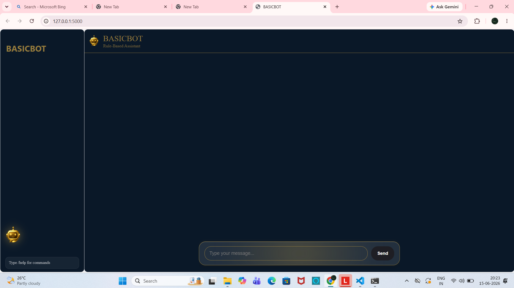
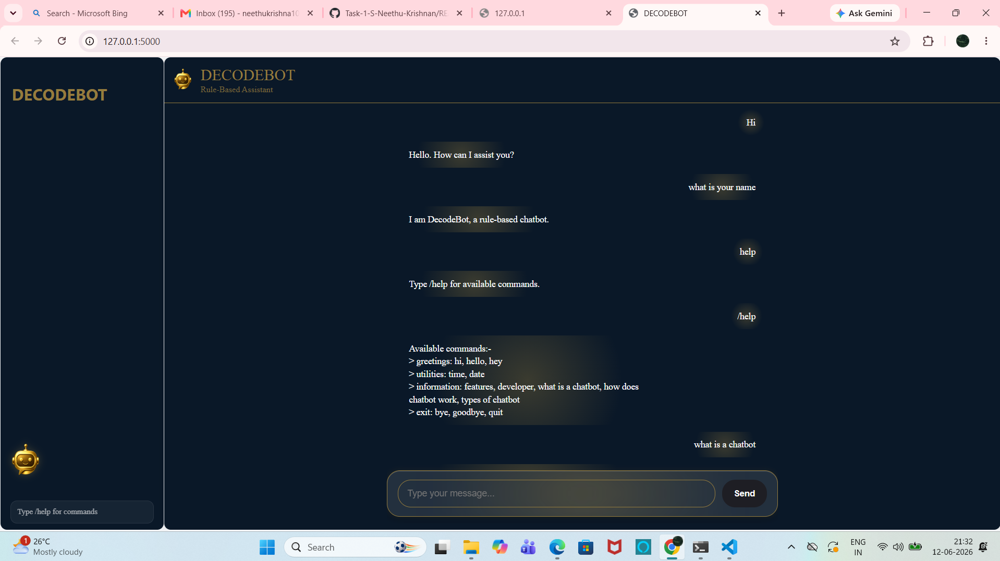
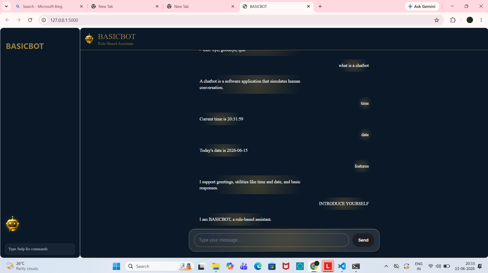

# Rule-Based Chatbot

## Project Description
This project is a simple Rule-Based Chatbot developed using Python, HTML, CSS, and JavaScript. The chatbot responds to user queries based on predefined rules and patterns.

## Features
- Interactive chatbot interface
- Rule-based response generation
- Simple and user-friendly design
- Real-time conversation handling

## Technologies Used
- Python
- HTML
- CSS
- JavaScript

## Project Structure
- chatbot.py - Backend chatbot logic
- templates/ - HTML files
- static/ - CSS, JavaScript, and images

## Project Screenshots

Below are some sample outputs of the chatbot system:

### Interface

### Conversation Example1

### Conversation Example2

## How to Run
1. Install Python on your system.
2. Open the project folder.
3. Run chatbot.py.
4. Open the application in your browser.

## Author
S NEETHU KRISHNAN
